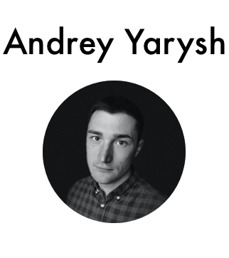

    

    
    
    

---

I'm a backend developer with a solid knowledge of PHP, Go and Python and team leader experience. Self-taught, quick learner, believer in code serving business goals and not the other way around.

 

## Experience 

#### Software Developer, [Zoon.ru](https://zoon.ru/){:target="_blank"}
##### June 2017 - April 2021 | Moscow, Russia

Backend developer in the B2C team.

— Developed new and supported existing business features that users interact with such as different catalogues, search, comments, etc. Participated in the development of APIs for our affiliates and mobile app.

— Responsible for the company's call tracking system based on Asterisk and Lua. Developed and supported middleware based on Golang for collecting and processing calls.

— Became a team lead and got additional responsibilities for code review, deploying features and hiring (July 2019)

— Technologies used: PHP 7, Golang, MongoDB, Elasticsearch, Docker, Asterisk, Lua, Python 3
 

#### Software Developer, Freelance
##### January 2016 - May 2017 | Kostroma, Russia

Worked as an individual developer on different projects that were found on Upwork and other freelancing platforms. The most interesting are:

— CRM system for goods suppliers for an [online store](https://akson.ru){:target="_blank"}, project was developed in PHP5 (Symfony2) and MSSQL

— Developed from scratch [Skeretar.io](https://sekretar.io){:target="_blank"} - an answering machine-like service that transcripts incoming calls and sends messages to email/Telegram app. Main tech stack: Python3 (Django + DRF), Celery (RabbitMQ), PostgreSQL, ReactJS (Redux), Asterisk.
 

#### Software Developer, [Gruzopoisk.ru](https://gruzopoisk.ru/){:target="_blank"}
##### January 2012 - December 2015 | Moscow, Russia

I started working on the project as a freelancer at its very beginning, when it was just a pet-project for its founders. Later, when our project got investments, I became a permanent member of the team.

I was responsible of developing project's server side in PHP and Python and working on data integration with internal services: CRM, newsletter system, statistics.
The project team consisted of 5 members. The tech stack was: PHP5 (Phalcon), Python3 (Django), PostgreSQL, Redis, JQuery, ElasticSearch, Kibana.

 

## Education

#### Kostroma State Technological University (KSTU)
##### (2006 - 2011) | Kostroma, Russia

Bachelor of Engineering - BE, Technology and Machinery for Natural Fibers Manufacturing

 

## Courses

#### [Developing web services with Go - language basics](https://www.coursera.org/account/accomplishments/verify/JT29V4TZ79TS){:target="_blank"}
##### September 2018 | Coursera.org
